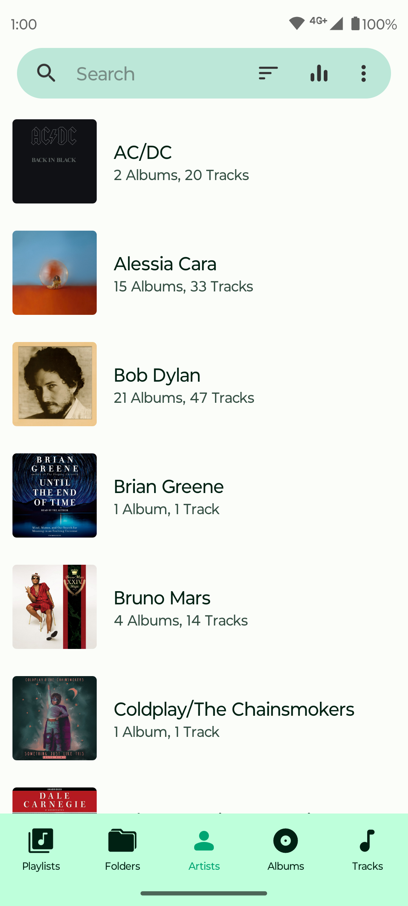
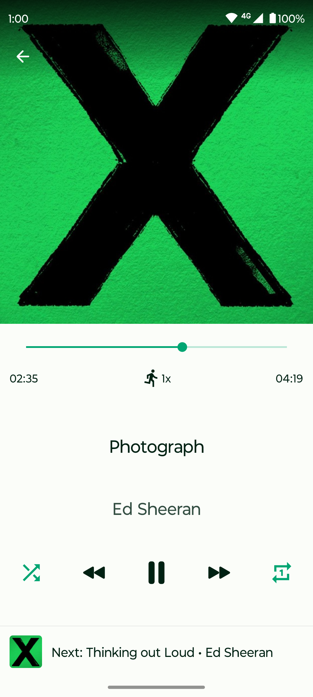
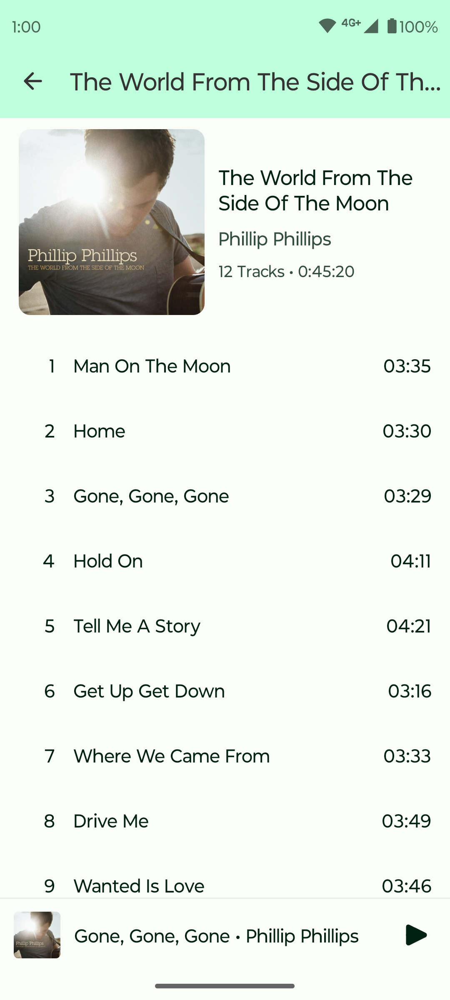

# Fossify Music Player

  

Introducing Fossify Music Player – your gateway to uninterrupted musical enjoyment. Say goodbye to intrusive ads and hello to a seamless music experience
designed to accompany you wherever you go.

**🚫 AD-FREE LISTENING:**  
We understand the value of your time and the sanctity of your music experience. That's why Fossify Music Player is completely ad-free. No distractions, just
pure musical bliss. Whether you're at home, on the go, or exploring the great outdoors, enjoy your music without interruptions.

**📶 OFFLINE ACCESS:**  
Take your music with you wherever you go, even to mars. Fossify Music Player operates offline, ensuring you can enjoy your favorite tracks anytime, anywhere,
without needing an internet connection.

**🚀 LIGHTNING-FAST AND EFFICIENT:**  
Worried about draining your battery while indulging in your favorite tunes? Despite its rich features, Fossify Music Player maintains a small app size, ensuring
quick and hassle-free download and installation. Experience swift navigation and seamless performance while indulging in your favorite melodies.

**🎚️ POWERFUL EQUALIZER:**  
Elevate your listening experience with our powerful equalizer, offering a range of presets to suit every genre and audio preference. Adjust the music effects
based on your mood, genre, or even your audio setup for an immersive sound experience.

**🌙 SLEEP TIMER FOR RELAXING NIGHTS:**  
Soothe your nights with the Sleep Timer feature. Choose your favorite tunes and let them gently fade away as you drift off to sleep. Enjoy a peaceful night's
rest without worrying about the music playing on.

**📜 PLAYLIST MANAGEMENT:**  
Create and manage your playlists effortlessly. Organize your music library, customize track labels, and even edit song information to your liking. Shuffle,
repeat, skip, and forward your tracks with ease.

**🔒 PRIVACY ASSURED:**  
Your privacy is our top priority. Fossify Music Player does not collect or share any user information with third parties. Enjoy peace of mind knowing that your
musical journey remains private and secure.

**🌈 MODERN DESIGN & USER-FRIENDLY INTERFACE:**  
Enjoy a clean, modern design with a user-friendly interface. The app features a material design and a dark theme option, providing a visually appealing and
comfortable user experience.

**🎨 CUSTOMIZABLE INTERFACE:**  
Personalize your music experience with customizable widgets and interface colors. Control your music effortlessly from the status bar, widget, or headphone
buttons, all tailored to your preferences.

**🌐 OPEN-SOURCE TRANSPARENCY:**  
Your privacy is a top priority. Fossify Music Player operates completely offline, completely free of ads and does not request unnecessary permissions. Moreover,
it is fully open-source, providing you with peace of mind, as you have access to the source code for security and privacy audits.

Experience music the way it's meant to be – uninterrupted, personalized, and immersive. Download Fossify Music Player now and embark on a musical journey like
never before.

➡️ Explore more Fossify apps: https://www.fossify.org 
➡️ Open-Source Code: https://www.github.com/FossifyOrg 
➡️ Join the community on Reddit: https://www.reddit.com/r/Fossify 
➡️ Connect on Telegram: https://t.me/Fossify

